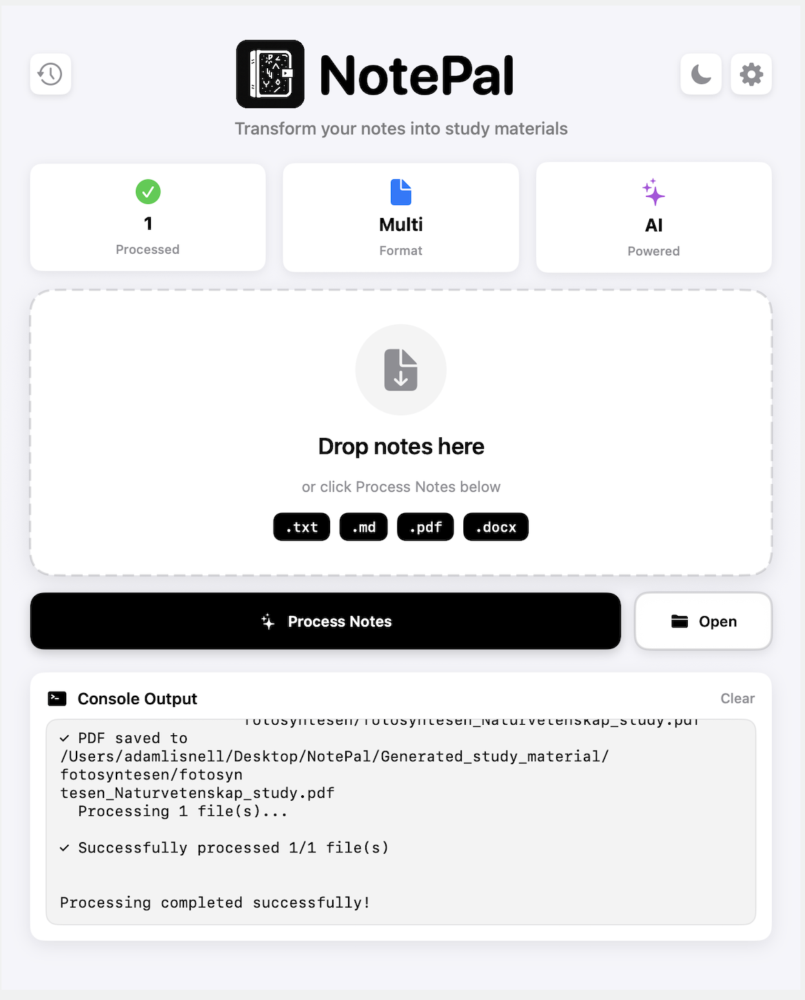
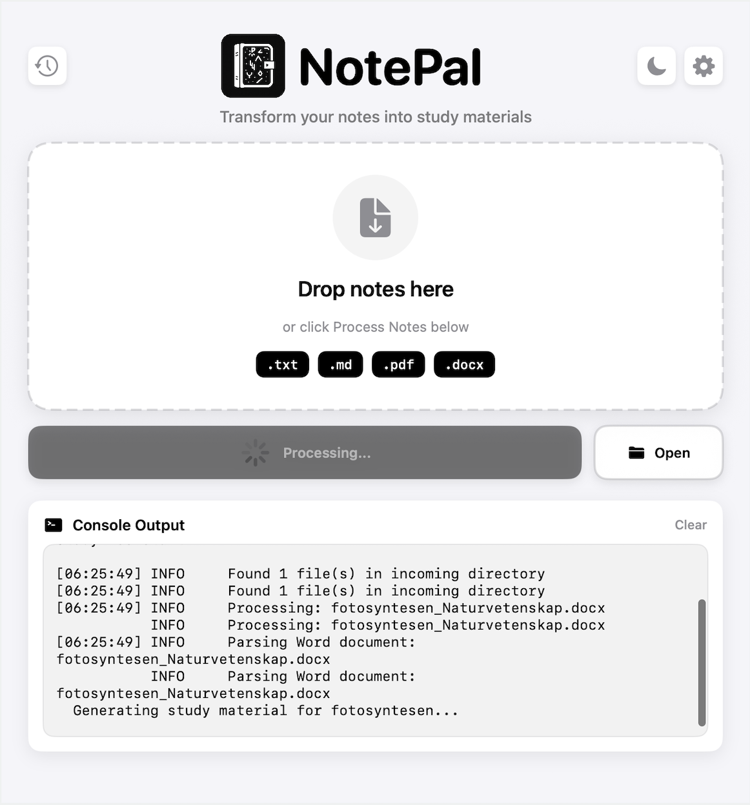
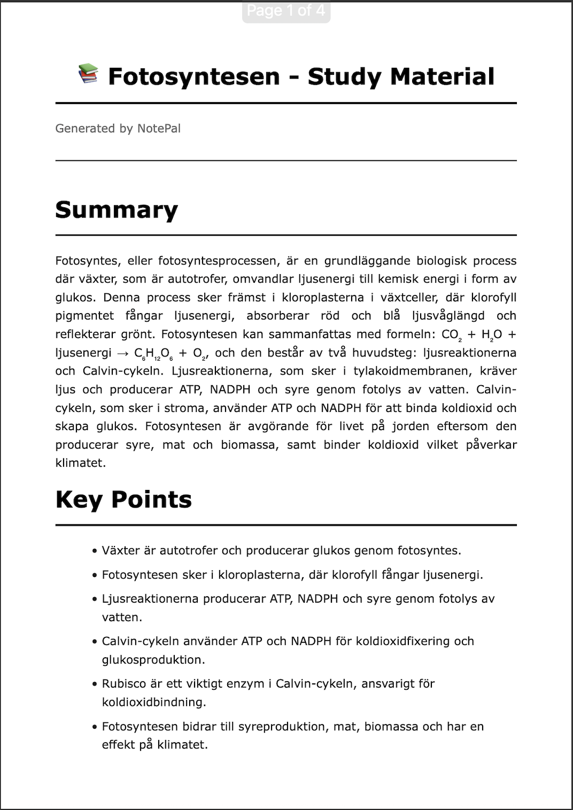

# NotePal - AI-Powered Study Assistant

Transform your lecture notes into comprehensive study materials automatically using AI.

[](https://www.python.org/downloads/)
[](https://opensource.org/licenses/MIT)
[](https://github.com/psf/black)

## Features

- **Multi-Format Support** - Process `.txt`, `.md`, `.pdf`, and `.docx` files
- **AI-Powered Generation** - Uses OpenAI GPT-4o-mini to create study materials
- **Comprehensive Output** - Generates summaries, key points, study questions, and flashcards
- **Dual Format Export** - Produces both Markdown and professionally styled PDF files
- **Auto-Processing** - File watcher automatically processes new notes
- **Subject Organization** - Automatically organizes materials by subject
- **Native macOS App** - SwiftUI interface with drag & drop support
- **Real-time Feedback** - Live console output during processing

## Screenshots

### macOS App Interface




### Generated Study Material


## Quick Start

### Prerequisites

- Python 3.9 or higher
- macOS (for GUI app)
- OpenAI API key

### Installation

1. **Clone the repository**
```bash
   git clone https://github.com/adamlisnell/study-assistant.git
   cd study-assistant
```

2. **Create virtual environment**
```bash
   python3 -m venv .venv
   source .venv/bin/activate
```

3. **Install dependencies**
```bash
   pip install -e ".[dev]"
```

4. **Configure environment**
```bash
   cp .env.example .env
   # Edit .env and add your OpenAI API key
```

### Configuration

Create a `.env` file in the project root:
```bash
# OpenAI Configuration
OPENAI_API_KEY=your-api-key-here
OPENAI_MODEL=gpt-4o-mini

# Folder Configuration
NOTES_INCOMING_DIR=/path/to/your/incoming/notes
NOTES_OUTPUT_DIR=/path/to/your/output/folder
PROCESSED_INDEX_PATH=/path/to/processed_index.json

# Application Settings
LOG_LEVEL=INFO
MAX_REQUESTS_PER_MINUTE=50
```

## Usage

### Command Line Interface

**Process notes once:**
```bash
study-assistant process
```

**Auto-watch for new files:**
```bash
study-assistant watch
```

**View configuration:**
```bash
study-assistant info
```

### macOS GUI App

1. Open `StudyAssistantApp.xcodeproj` in Xcode
2. Build and run (Command+R)
3. Drag and drop notes into the app
4. Click "Process Notes"
5. Click "Open Folder" to view results

### File Naming Convention

Files must follow the format: `subject_description.extension`

**Examples:**
- `math_chapter1.txt`
- `history_worldwar2.pdf`
- `biology_cells.docx`

## Output Format

Each processed note generates:

### Summary
- Concise overview (max 300 words)
- Main concepts and themes

### Key Points
- Bullet-point list of important concepts
- Easy-to-scan format

### Study Questions
- 10 comprehensive Q&A pairs
- Detailed answers for deeper understanding

### Flashcards
- 10 front/back flashcard pairs
- Perfect for quick review

## Tech Stack

**Backend:**
- Python 3.9+
- OpenAI API (GPT-4o-mini)
- Pydantic for configuration
- Rich for beautiful console output
- WeasyPrint for PDF generation
- Watchdog for file monitoring

**Document Processing:**
- pypdf - PDF extraction
- python-docx - Word documents
- pdfplumber - Advanced PDF parsing

**Frontend:**
- Swift/SwiftUI - Native macOS app
- Drag and drop interface
- Real-time process monitoring

## Project Structure
```
study-assistant/
├── src/study_assistant/
│   ├── __init__.py
│   ├── __main__.py          # CLI entry point
│   ├── config.py            # Configuration management
│   ├── processor.py         # Main processing logic
│   ├── openai_client.py     # OpenAI API integration
│   ├── file_handler.py      # File operations
│   ├── subject_parser.py    # Subject extraction
│   ├── document_parser.py   # Multi-format parsing
│   ├── pdf_generator.py     # PDF creation
│   ├── auto_watcher.py      # File watching
│   └── utils/
│       └── logger.py        # Logging utilities
├── StudyAssistantApp/       # SwiftUI macOS app
│   ├── ContentView.swift
│   └── Assets.xcassets/
├── tests/                   # Unit tests
├── .env.example             # Example configuration
├── pyproject.toml          # Python dependencies
└── README.md
```

## Development

### Setup Development Environment
```bash
# Install with dev dependencies
pip install -e ".[dev]"

# Run tests
pytest

# Format code
black src/
isort src/

# Type checking
mypy src/

# Linting
pylint src/
```

### Running Tests
```bash
pytest --cov=src/study_assistant --cov-report=html
```

## Contributing

Contributions are welcome! Please feel free to submit a Pull Request.

1. Fork the repository
2. Create your feature branch (`git checkout -b feature/AmazingFeature`)
3. Commit your changes (`git commit -m 'Add some AmazingFeature'`)
4. Push to the branch (`git push origin feature/AmazingFeature`)
5. Open a Pull Request

## License

This project is licensed under the MIT License - see the [LICENSE](LICENSE) file for details.

## Acknowledgments

- OpenAI for the GPT API
- WeasyPrint for PDF generation
- The Python and Swift communities

## Contact

Adam Lisnell - adam.lisnell@gmail.com

Project Link: [https://github.com/adamlisnell/study-assistant](https://github.com/adamlisnell/study-assistant)

---

**Built by Adam Lisnell**
